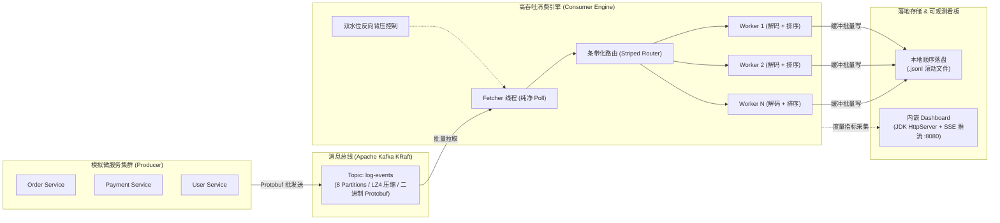

# 系统全栈技术选型与架构深度分析

> **文档定位**：本文档针对 Kafka Log System（高吞吐日志采集与消费处理系统）的技术栈选型、架构设计思想、分层实现细节及关键技术决策权衡进行系统性、全景式的深度分析。

---

## 1. 系统全景与设计目标

Kafka Log System 是面向高并发、低延迟、高吞吐场景设计的微服务日志采集、传输、解码与持久化系统。其核心业务流转链路如下：



### 核心架构设计指标
1. **网络与数据高吞吐**：依托批量聚合（Batching）、二进制编码（Protobuf）与硬件友好型压缩（LZ4），最大化吞吐能力。
2. **时序与数据完整性**：服务内日志按键分区路由保证单分区强有序；微批按时间戳（TimSort）局部有序；采用批次屏障提交（Batch Barrier Commit）实现 At-Least-Once。
3. **极简轻量、零多余开销**：全链路去除重量级框架（如 Spring Boot、Tomcat），监控看板依托 JDK 原生 HttpServer，进程极低内存脚手架占用，毫秒级冷启动。
4. **防御型背压与文件系统保护**：高低双水位动态暂停/恢复 Kafka 拉取；杜绝海量小文件，采用大小与时间双维度滚动的 JSON Lines（`.jsonl`）顺序持久化。

---

## 2. 技术栈总览矩阵 (Technology Stack Matrix)

| 层次维度 | 核心选型 | 版本 | 核心作用与定位 | 关键设计优势 |
| :--- | :--- | :--- | :--- | :--- |
| **基础运行环境** | **Java (OpenJDK)** | **21 (LTS)** | 核心编程语言与并发运行时 | 现代化 LTS，拥有出色的 JMM 内存模型、增强型并发原语及优异的 ZGC/G1 垃圾回收表现 |
| **构建管理** | **Apache Maven** | **3.x** | 多模块工程编排与构建管理 | 规范化生命周期管理、统一依赖版本锁定（DependencyManagement） |
| **消息中间件** | **Apache Kafka** | **4.0.0 (Client)<br/>4.3.1 (Broker)** | 分布式高性能消息发布订阅总线 | KRaft 无元数据单点模式，高分区并发，极高吞吐 |
| **传输协议** | **Google Protobuf** | **3.25.6** | 日志数据跨服务/跨网络二进制序列化协议 | 极高序列化/反序列化速度，紧凑二进制编码大幅节省带宽与 CPU 周期 |
| **构建扩展插件** | **Protobuf Maven Plugin<br/>OS Maven Plugin** | **0.6.1<br/>1.7.1** | 构建期自动化编译 `.proto` 为 Java DTO | 跨平台自动检测操作系统架构，无需人工配置本地 protoc 二进制 |
| **数据处理与序列化** | **Jackson Databind** | **2.17.3** | JSON Lines 生成与监控指标 JSON 转换 | 成熟稳定，丰富的类型映射与流式生成能力 |
| **监控 Web 服务** | **JDK 内置 HttpServer** | **Java 21 原生** | 内嵌轻量级度量上报与看板服务 | **零外部容器依赖**（无需 Tomcat/Jetty/Spring Web），以守护线程常驻，不影响核心消费链路 |
| **实时通信机制** | **SSE (Server-Sent Events)** | **W3C 标准** | Dashboard 实时度量每秒主动推流 | 相比 WebSocket 更加轻量，单向推流，断线自动重连，防火墙与 HTTP/1.1 友好 |
| **前端看板架构** | **Vanilla HTML5 / CSS / JS** | **ES6+ / 现代 CSS** | 单页实时运维大屏（SPA） | 独立打包至 JAR 内，零构建链依赖，纯原生 Canvas 绘制实时 TPS 与延迟曲线 |
| **日志与门面** | **SLF4J + Logback** | **2.0.16 + 1.5.16** | 生产级结构化异步日志输出 | 规范化日志门面与高性能异步文件滚动落地 |
| **分发与打包** | **Maven Assembly Plugin** | **3.7.1** | 生成开箱即用的 Fat-JAR (All-in-one) | 包含完整依赖，直接通过 `java -jar` 一键独立启动 |

---

## 3. 分层技术深度解析与选型依据

### 3.1 基础与构建层：Java 21 + Maven 多模块聚合

项目采用了经典的 Maven 父子模块（Parent-POM）组织架构：
* **[Parent POM](file:///home/fugui/workspace/kafka-test/kafka-log-system/pom.xml)**：统一维护全局依赖版本（`dependencyManagement`）与构建插件版本（`pluginManagement`），将源码和目标字节码固定在 Java 21。
* **[Common 模块](file:///home/fugui/workspace/kafka-test/kafka-log-system/common)**：公共契约层，包含 Protobuf 协议文件与 Kafka 客户端统一配置。
* **[Producer 模块](file:///home/fugui/workspace/kafka-test/kafka-log-system/producer)**：多服务随机日志生成与并发推送引擎。
* **[Consumer 模块](file:///home/fugui/workspace/kafka-test/kafka-log-system/consumer)**：高性能消费引擎、落盘器与内置 Web 看板。

#### 自动化 Protobuf 编译流水线
在 [common/pom.xml](file:///home/fugui/workspace/kafka-test/kafka-log-system/common/pom.xml) 中配置了 `os-maven-plugin` 与 `protobuf-maven-plugin`：
```xml
<plugin>
    <groupId>org.xolstice.maven.plugins</groupId>
    <artifactId>protobuf-maven-plugin</artifactId>
    <version>0.6.1</version>
    <configuration>
        <protocArtifact>com.google.protobuf:protoc:${protobuf.version}:exe:${os.detected.classifier}</protocArtifact>
        <protoSourceRoot>${project.basedir}/src/main/proto</protoSourceRoot>
    </configuration>
    <executions>
        <execution>
            <goals><goal>compile</goal></goals>
        </execution>
    </executions>
</plugin>
```
* **跨平台兼容**：自动根据当前操作系统架构（如 Linux x86_64、macOS aarch64）拉取对应的官方 `protoc` 编译可执行程序。
* **开发无感**：在标准 Maven `compile` 阶段自动将 [log_message.proto](file:///home/fugui/workspace/kafka-test/kafka-log-system/common/src/main/proto/log_message.proto) 生成强类型的 Java 代码，避免手动维护 DTO。

---

### 3.2 传输与契约层：Protobuf 3 vs. JSON

系统定义了结构化的日志实体模型 [log_message.proto](file:///home/fugui/workspace/kafka-test/kafka-log-system/common/src/main/proto/log_message.proto)：
```protobuf
syntax = "proto3";
package com.demo.kafka.common;

message LogMessage {
  int64  timestamp    = 1;   // Unix epoch 毫秒级时间戳
  string log_id       = 2;   // UUID
  Level  level        = 3;   // DEBUG / INFO / WARN / ERROR / FATAL
  string source       = 4;   // 服务名称 (e.g., "order-service")
  string thread_name  = 5;   // 线程名称
  string message      = 6;   // 日志正文
  string host_ip      = 7;   // 主机 IP
  string trace_id     = 8;   // 分布式追踪 ID
  map<string, string> extra_fields = 9; // 扩展元数据
}
```

#### 为什么传输层放弃文本 JSON，选择 Protobuf？
1. **体积压缩率**：纯文本 JSON 存在大量重复的 Key（如 `"timestamp"`、`"thread_name"`）和转义字符。Protobuf 基于 Varint 和 Tag-Length-Value (TLV) 编码，网络传输体积仅为明文 JSON 的 **25% ~ 40%**。
2. **CPU 序列化开销**：Protobuf 生成的字节流直接按二进制字段映射，不需要复杂的字符串解析、转义和浮点数转换，反序列化速度比 Jackson/Fastjson 快 **3 ~ 6 倍**。
3. **严格向前向后兼容性**：基于数字 Tag 标号，字段扩充不会破坏存量消费端。

---

### 3.3 消息通道层：Kafka 生产与消费调优策略

在 [KafkaConfig.java](file:///home/fugui/workspace/kafka-test/kafka-log-system/common/src/main/java/com/demo/kafka/common/KafkaConfig.java) 中针对高吞吐日志场景进行了精细化参数调优：

#### Producer 吞吐优化参数
* `batch.size = 65536 (64KB)`：将单条消息发送转为 64KB 的内存块批量发送。
* `linger.ms = 5`：轻微引入 5ms 的等待窗口，大幅提升凑批率，在突发洪峰时平滑吞吐。
* `buffer.memory = 67108864 (64MB)`：为并发发送队列提供充裕的内存池，避免瞬时网络抖动导致阻塞。
* `compression.type = lz4`：选用对 CPU 开销极低且吞吐极高的 LZ4 算法，结合 Protobuf 进一步压榨网络带宽。
* `acks = 1`：Leader 分区确认即返回，在日志业务场景中在“高吞吐”与“可靠性”间取得最佳平衡。
* **分区路由保证**：[LogProducer.java](file:///home/fugui/workspace/kafka-test/kafka-log-system/producer/src/main/java/com/demo/kafka/producer/LogProducer.java#L55) 中以 `logMessage.getSource()`（微服务名称）作为 Kafka Key，确保同一服务的日志进入同一分区，保证单服务日志绝对有序。

#### Consumer 吞吐优化参数
* `enable.auto.commit = false`：禁用自动提交，由消费引擎完成批次落盘后再提交位移，防止宕机丢数据。
* `max.poll.records = 5000`：单次 poll 最大拉取 5000 条记录，降低拉取频率与线程上下文切换。
* `fetch.min.bytes = 1048576 (1MB)` & `fetch.max.bytes = 52428800 (50MB)`：确保单次网络请求携带足够的有效载荷。
* `max.partition.fetch.bytes = 10485760 (10MB)`：防止单分区数据倾斜导致网络缓冲区耗尽。

---

### 3.4 消费与落盘引擎：架构流水线与并发设计

核心位于 [HighThroughputConsumerEngine.java](file:///home/fugui/workspace/kafka-test/kafka-log-system/consumer/src/main/java/com/demo/kafka/consumer/HighThroughputConsumerEngine.java)：

#### 1. 专职 Fetcher 线程与条带化路由 (Striped Routing)
* 单独由一个 `fetcherThread` 专职执行 `consumer.poll(...)`，**严禁在拉取线程内进行耗时的业务解码与磁盘 IO**。
* 拉取到的记录根据 `TopicPartition.partition()` 进行 Hash 取模，分发到对应 Worker 的专属无锁阻塞队列 `BlockingQueue<TaskWrapper>`。
* **优势**：消除了多 Worker 争抢同一队列的并发锁竞争，并从根本上保障了单个分区的消息消费顺序。

#### 2. Worker 解码、TimSort 排序与微批聚合
* 每个 Worker 线程从专有队列中批量拉取数据，调用 [ProtobufDecoder](file:///home/fugui/workspace/kafka-test/kafka-log-system/consumer/src/main/java/com/demo/kafka/consumer/ProtobufDecoder.java) 进行二进制反序列化。
* 在微批内部使用 **TimSort（基于时间戳）** 进行保序，修正网络或并发带来的微小时序倒挂。

#### 3. 动态高低水位反向背压 (Dual Watermark Backpressure)
* **监控水位**：Fetcher 监控所有 Worker 队列的积压情况。
* **触发暂停**：当队列利用率超过高水位（High Watermark，如 80%）时，调用 `consumer.pause(partitions)` 暂停拉取，停止网络接收。
* **触发恢复**：当 Worker 消费消化积压降至低水位（Low Watermark，如 30%）时，调用 `consumer.resume(partitions)` 恢复拉取。
* **优势**：防止突发大流量瞬间冲垮 JVM 堆内存导致 OOM。

#### 4. 批次屏障位移提交 (Batch Barrier Commit)
* 每一批次 poll 的消息集合关联一个原子计数器（Barrier）。
* 只有当负责该批次所有分区的 Worker 全部落盘完毕后，计数器归零，触发精准位移提交。

#### 5. 顺序滚动持久化 [RollingJsonWriter](file:///home/fugui/workspace/kafka-test/kafka-log-system/consumer/src/main/java/com/demo/kafka/consumer/RollingJsonWriter.java)
* **避免文件爆炸**：坚决禁止每条日志单独写文件的愚蠢做法，统一采用按行追加的 JSON Lines (`.jsonl`) 格式。
* **线程独占写入器**：每个 Worker 独占一个写入器实例与一个独立打开的文件句柄，**零文件写锁竞争**。
* **双维度滚动**：
  * **大小维度**：文件达到指定阈值（默认 50MB）时自动滚动切换。
  * **时间维度**：文件存活达到指定时间（默认 2 分钟）时自动切片。
* **缓冲区优化**：配置 1MB 内部 `BufferedWriter`，配合定期 `flush`，保证系统调用的顺序大块落盘。

---

### 3.5 监控与 Web 体系：轻量级零依赖 Dashboard

系统在 Consumer 端集成了实时运维看板（默认访问 `http://localhost:8080`），核心位于 [DashboardServer.java](file:///home/fugui/workspace/kafka-test/kafka-log-system/consumer/src/main/java/com/demo/kafka/consumer/dashboard/DashboardServer.java)。

#### 为什么采用 JDK 原生 `HttpServer`？
在日志消费这类吞吐敏感型底层引擎中，引入大型 Web 框架具有显著弊端：
1. **Spring Boot / Tomcat 方案的痛点**：引入数百个依赖 Jar 包，增加 100MB+ 内存基线，启动缓慢，并带来几十个非守护线程。
2. **JDK 原生 HttpServer 方案的优势**：
   * **零外部依赖**：直接复用 Java 21 标准库 `com.sun.net.httpserver`。
   * **线程可控**：以守护线程（Daemon Thread）启动后台执行器，在消费引擎关闭时随宿主自动终结，绝不阻碍两阶段优雅停机。
   * **极低开销**：单线程处理静态资源加载与 REST 查询，对核心消费流程的 CPU 干扰趋近于 0。

#### SSE（Server-Sent Events）实时推流与原生前端
* **接口设计**：
  * `GET /api/metrics`：单次度量快照查询。
  * `GET /api/metrics/threads`：运行时 JVM 线程状态详情。
  * `GET /api/metrics/stream`：**SSE 实时长连接推流**，每秒推送最新的摄入 QPS、落盘吞吐量、各 Worker 积压深度及 P50/P99 耗时。
* **前端呈现**：[index.html](file:///home/fugui/workspace/kafka-test/kafka-log-system/consumer/src/main/resources/static/index.html) 单文件单页应用，纯原生 Canvas 绘制平滑波形图，直观展现系统压力与背压状态。

---

## 4. 关键技术选型对比与架构权衡

| 架构维度 | 本系统选型 | 备选方案 | 为什么做此决策？（权衡收益与代价） |
| :--- | :--- | :--- | :--- |
| **消息序列化** | **Google Protobuf** | 纯文本 JSON / XML | **收益**：体积缩减 60%+，吞吐提升 3~5 倍。<br/>**代价**：需要维护 proto 定义并增加编译步骤。 |
| **Web 监控底座** | **JDK 内置 HttpServer** | Spring Boot / Netty | **收益**：轻量级守护运行，无额外包依赖，极速启停。<br/>**代价**：不支持复杂路由与注解式开发（当前场景仅需 3 个 API，完全满足）。 |
| **Worker 调度模型**| **条带化固定分区绑定** | 共享 ThreadPool / 无序抢占 | **收益**：彻底保证单分区全局保序，各 Worker 无锁并发。<br/>**代价**：若单分区流量严重倾斜可能导致 Worker 负载不均（通过增加分区打散）。 |
| **磁盘落地格式** | **滚动 JSON Lines (.jsonl)** | 关系型数据库 / ES 直接入库 | **收益**：顺序写盘速度可达数百 MB/s，保护操作系统 Inode，便于后续大数据批处理。<br/>**代价**：实时检索需后续异步通过 Filebeat/Logstash 搬运。 |
| **Kafka 协调模式** | **KRaft 模式** | ZooKeeper 模式 | **收益**：消除 ZooKeeper 单点依赖，元数据同步快，百万分区恢复更快。<br/>**代价**：需要使用现代版本 Kafka (3.x/4.x)。 |

---

## 5. 工程构建、运行与常见排障指南

### 5.1 正确的构建流程

本系统为 Maven 多模块工程，聚合父模块位于 `kafka-log-system/` 目录下。

```bash
# 1. 切换到项目工程根目录 (包含 parent pom.xml 的目录)
cd /home/fugui/workspace/kafka-test/kafka-log-system

# 2. 清理、编译 proto、打包可执行 fat jar
mvn clean package -DskipTests
```

> [!CAUTION]
> **常见构建错误说明**：
> 1. **在 workspace 根目录执行 `mvn`**：由于 `/home/fugui/workspace/kafka-test` 下没有 `pom.xml`，Maven 会抛出 `MissingProjectException`。必须进入 `kafka-log-system` 目录执行。
> 2. **执行 `mvn build`**：Maven 标准生命周期只有 `compile`, `test`, `package`, `install`, `clean` 等，**不存在 `build` 这个 Phase**。使用 `mvn clean package` 才是正确命令。

---

### 5.2 运维与运行流水线

项目在根目录下提供了完备的自动化 Shell 运维脚本：

| 脚本名称 | 核心功能 | 对应内部操作 |
| :--- | :--- | :--- |
| **[start-kafka.sh](file:///home/fugui/workspace/kafka-test/start-kafka.sh)** | 启动 KRaft 本地 Kafka 单机/集群 | 格式化并以 KRaft 模式后台启动 Kafka Broker |
| **[setup-topic.sh](file:///home/fugui/workspace/kafka-test/setup-topic.sh)** | 初始化核心日志 Topic | 创建 8 个分区的 `log-events` 主题 |
| **[status-kafka.sh](file:///home/fugui/workspace/kafka-test/status-kafka.sh)** | 检查 Kafka 运行状态与端口 | 检查 Broker 进程存活与端口监听 |
| **[run-consumer.sh](file:///home/fugui/workspace/kafka-test/run-consumer.sh)** | 启动高吞吐消费者与看板 | 运行 Consumer Fat-JAR，启动 8080 端口 Dashboard |
| **[run-producer.sh](file:///home/fugui/workspace/kafka-test/run-producer.sh)** | 启动多服务随机日志生产者 | 运行 Producer Fat-JAR，模拟生成高并发日志流 |
| **[stop-kafka.sh](file:///home/fugui/workspace/kafka-test/stop-kafka.sh)** | 优雅停止 Kafka 服务 | 安全关闭 Broker 并清理临时锁 |

---

## 6. 核心源码索引与文件导览

* **数据模型与契约**：
  * [log_message.proto](file:///home/fugui/workspace/kafka-test/kafka-log-system/common/src/main/proto/log_message.proto)：Protobuf 二进制定义
  * [KafkaConfig.java](file:///home/fugui/workspace/kafka-test/kafka-log-system/common/src/main/java/com/demo/kafka/common/KafkaConfig.java)：生产者与消费者核心调优参数
* **生产者核心实现**：
  * [LogProducer.java](file:///home/fugui/workspace/kafka-test/kafka-log-system/producer/src/main/java/com/demo/kafka/producer/LogProducer.java)：带限速与分区路由的 Kafka 生产者
  * [RandomLogGenerator.java](file:///home/fugui/workspace/kafka-test/kafka-log-system/producer/src/main/java/com/demo/kafka/producer/RandomLogGenerator.java)：微服务多场景日志模拟器
* **消费者核心实现**：
  * [HighThroughputConsumerEngine.java](file:///home/fugui/workspace/kafka-test/kafka-log-system/consumer/src/main/java/com/demo/kafka/consumer/HighThroughputConsumerEngine.java)：拉取、路由、背压、位移提交引擎
  * [RollingJsonWriter.java](file:///home/fugui/workspace/kafka-test/kafka-log-system/consumer/src/main/java/com/demo/kafka/consumer/RollingJsonWriter.java)：大小/时间双维度滚动 JSONL 写入器
  * [ProtobufDecoder.java](file:///home/fugui/workspace/kafka-test/kafka-log-system/consumer/src/main/java/com/demo/kafka/consumer/ProtobufDecoder.java)：极速二进制解码器
* **监控与展示**：
  * [DashboardServer.java](file:///home/fugui/workspace/kafka-test/kafka-log-system/consumer/src/main/java/com/demo/kafka/consumer/dashboard/DashboardServer.java)：JDK 原生 HttpServer + SSE 实时推流服务器
  * [index.html](file:///home/fugui/workspace/kafka-test/kafka-log-system/consumer/src/main/resources/static/index.html)：单页前端大屏看板
